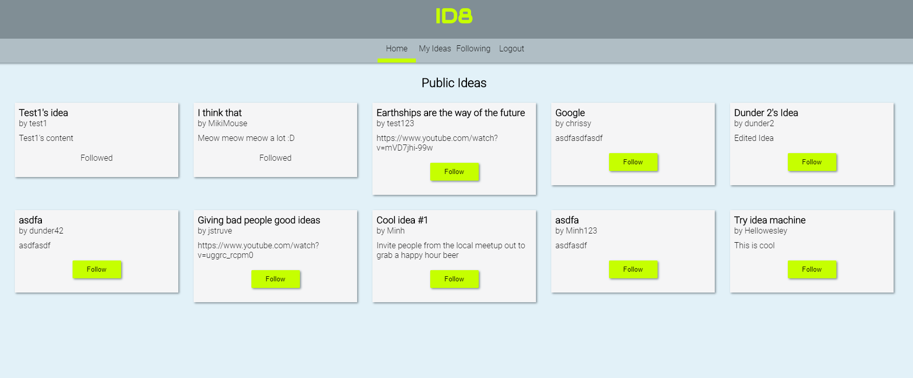
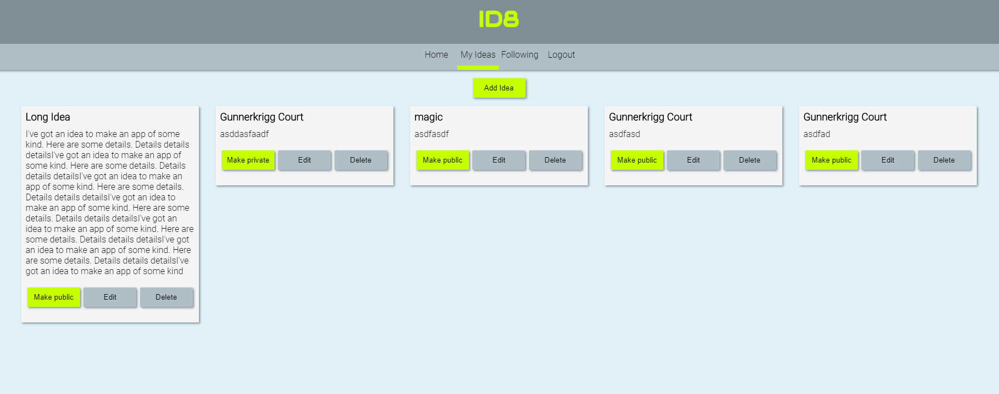
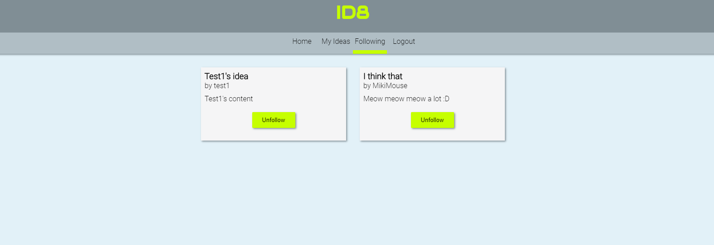

# ID8 by Wesley Rou

Live App: https://idea-machine.vercel.app/
Server Repo: https://github.com/thinkful-ei-panda/idea-machine-api

## Summary

ID8 is an app that allows a user to save development ideas and get inspiration from other users' public ideas.

## Screenshots

### Homepage

Get inspiration to display other users' public Ideas. Follow the ones you want to track.

### My Ideas Page

Add, Edit, Delete your Ideas or make them Public or Private.

### Followed Ideas Page

See which Ideas you have tracked and Unfollow the ones you are no longer interested in.

## Technology

Made with the React framework. Routing done with React Router.